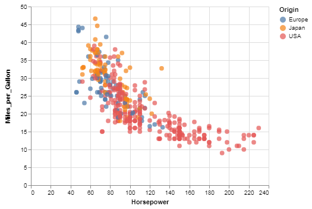
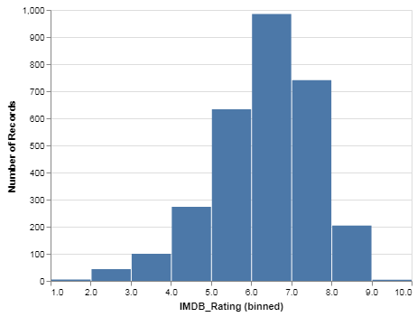
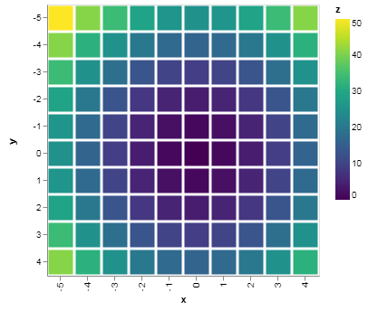

---
redirect_from:
  - "/section-01/chapters/03-los-clasicos"
interact_link: content/section-01/chapters/03-los-clasicos.ipynb
title: 'Los Clásicos'
prev_page:
  url: /section-01/chapters/02-desventajas
  title: 'Desventajas'
next_page:
  url: /section-02/causality-and-experiments
  title: 'Causality and Experiments'
comment: "***PROGRAMMATICALLY GENERATED, DO NOT EDIT. SEE ORIGINAL FILES IN /content***"
---

# Los Clásicos

Lorem ipsum dolor amet jean shorts palo santo chia artisan asymmetrical synth pop-up butcher post-ironic tote bag direct trade. Authentic sustainable irony XOXO lumbersexual photo booth iPhone lomo echo park trust fund godard. 3 wolf moon swag pop-up, kickstarter pickled kale chips post-ironic. Truffaut vape tacos air plant thundercats edison bulb, retro pinterest hammock.

Tbh iPhone 90's enamel pin offal taxidermy, church-key echo park 8-bit asymmetrical health goth. Swag master cleanse mumblecore woke kitsch normcore. Meggings la croix green juice, authentic chia vape cold-pressed poutine biodiesel lomo next level vegan put a bird on it. Tacos affogato blog chartreuse hammock, typewriter meditation hot chicken taiyaki succulents waistcoat cronut green juice lyft. Cold-pressed viral +1 semiotics meditation, chambray biodiesel forage letterpress wolf umami cloud bread YOLO XOXO. Hot chicken ramps freegan next level live-edge marfa stumptown butcher lo-fi edison bulb bespoke.

#### _Gráfico de dispersión_ (aka _scatterplot_)


{:.input_area}
```python
import altair as alt
from vega_datasets import data

cars = data.cars()

alt.Chart(cars).mark_circle(size=60).encode(
    x='Horsepower',
    y='Miles_per_Gallon',
    color='Origin',
    tooltip=['Name', 'Origin', 'Horsepower', 'Miles_per_Gallon']
).properties(
    height = 350,
    width = 500,
).interactive()
```





#### _Gráfico de barras_ (aka _bar chart_)


{:.input_area}
```python
import altair as alt
import pandas as pd

data = pd.DataFrame({
    'a': ['A', 'B', 'C', 'D', 'E', 'F', 'G', 'H', 'I'],
    'b': [28, 55, 43, 91, 81, 53, 19, 87, 52]
})

alt.Chart(data).mark_bar().encode(
    x='a',
    y='b'
).properties(
    height = 400,
    width = 500,
)
```





#### _Mapa de calor_ (aka _heatmap_)


{:.input_area}
```python
import altair as alt
import numpy as np
import pandas as pd

# Compute x^2 + y^2 across a 2D grid
x, y = np.meshgrid(range(-5, 5), range(-5, 5))
z = x ** 2 + y ** 2

# Convert this grid to columnar data expected by Altair
data = pd.DataFrame({'x': x.ravel(),
                     'y': y.ravel(),
                     'z': z.ravel()})

alt.Chart(data).mark_rect().encode(
    x='x:O',
    y='y:O',
    color='z:Q'
).properties(
    height = 500,
    width = 500
)
```





#### _Histograma_


{:.input_area}
```python
import altair as alt
from vega_datasets import data

movies = data.movies.url

alt.Chart(movies).mark_bar().encode(
    alt.X("IMDB_Rating:Q", bin=True),
    y='count()',
).properties(
    width = 500,
    height = 300,
)
```


